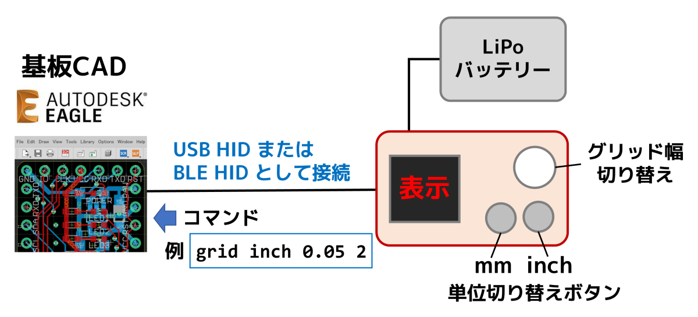
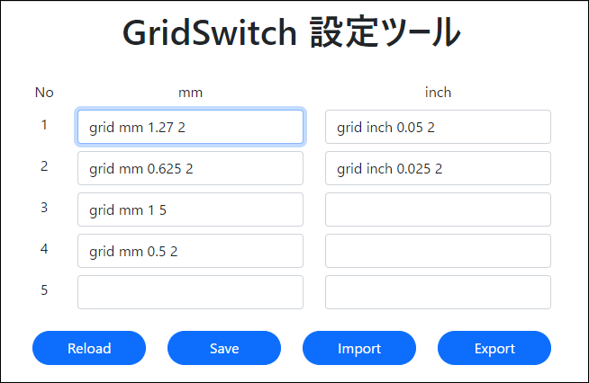

GridSwitch
=========


## 概要
基板CAD Eagle用のグリッド切り替えデバイスです。
* 有線接続(USB HID)と無線接続(BLE HID)の両方に対応。
* 2つのボタンでグリッドの単位(mm / inch)を切り替えます。
* ツマミでグリッド幅を切り替えます。
* グリッドの単位/幅を設定するコマンドの設定はUSB接続時にWebアプリから設定可能。<br>(PC版の Chrome や Edge など Web Serial API に対応したブラウザが必要)
* Nordic nRF52840 搭載。 (Seeed Studio XIAO nRF52840)
* [XIAOGYAN](https://github.com/algyan/XIAOGYAN) の基板を使用。



## コマンドの設定
[Webアプリ](app/DebuggerKB_Config/)から、グリッドの単位/幅を設定するコマンドを設定できます。

キーボードをUSB接続すると、HIDと仮想COMポートの複合デバイスになるので、Webアプリから仮想COMポートを選択して接続します。



## デフォルトのコマンド設定
初期状態では4つのグリッド幅が登録されています。最大5つまで登録できます。

| No | mm | inch | 備考 |
| -- | -- | ---- | ---- |
| 1  | grid mm 1.27 2   | grid inch 0.05 2  | 0.05" (1.27mm) 幅, 0.1" 表示    |
| 2  | grid mm 0.625  2 | grid inch 0.025 2 | 0.025" (0.635mm) 幅, 0.05" 表示 |
| 3  | grid mm 1 5      | (未設定)          | 1mm幅, 5mm表示   |
| 4  | grid mm 0.5 2    | (未設定)          | 0.5mm幅, 1mm表示 |
| 5  | (未設定)　        | (未設定)          |   |


mmボタン と inchボタン を同時に押しながらUSBケーブルを接続するとコマンドがデフォルト設定に初期化されます。

## ファームウェアについて

* ファームウェアは Arduinoベースで作成しました。
* Arduino IDEの「ファイル」＞「環境設定」＞「追加のボードマネージャのURL」に下記URLを追加します。
```
https://files.seeedstudio.com/arduino/package_seeeduino_boards_index.json
```
* 「ツール」＞「ボード」＞「ボードマネージャ」で「Seeed nRF52 Boards」をインストールします。
* 「ツール」＞「ボード」で Seeed nRF52 Boards > Seeed XIAO nRF52840 を選択します。
* Seeed nRF52 mbed-enabled Boards ではないことに注意してください。
* シリアルポートが認識しないときは、USBコネクタの横の小さなリセットボタン(RSTのシルクあり)をダブルクリックしてください。

## 依存ライブラリ
<table>
<tr><td>Adafruit TinyUSB  </td><td>Seeed nRF52 Boards に付属</td></tr>
<tr><td>Adafruit LittleFS </td><td>Seeed nRF52 Boards に付属</td></tr>
<tr><td>InternalFileSystem</td><td>Seeed nRF52 Boards に付属</td></tr>
<tr><td>Adafruit Bluefruit</td><td>Seeed nRF52 Boards に付属</td></tr>
<tr><td><a href = "https://github.com/algyan/xiaogyan_arduino">xiaogyan_arduino</a>  </td><td>XIAOGYANサポートライブラリ ※1</td></tr>
<tr><td>Arduino Eigen</td><td>xiaogyan_arduinoが依存 ※2</td></tr>
<tr><td>Adafruit GFX</td><td>xiaogyan_arduinoが依存</td></tr>
<tr><td>Adafruit BusIO</td><td>Adafruit GFXが依存</td></tr>
</table>

### Seeed XIAO nRF52840 環境でのビルドエラーについて

1. src/Speaker.cpp, src/Speaker2.cpp のエラーの行をコメントアウト

2. ArduinoEigen/Eigen/src/Core/products/GeneralBlockPanelKernel.h の 変数名 D1, D2, D3, D4 を適当に変更<br> (ピン番号のマクロ定数名と競合のため)

## ファイル一覧

* firm/GridSwitch/
    * GridSwitch.ino : ファームウェア本体 (Arduinoスケッチ)
    * \*.h, \*.cpp: ファームウェアで使用する各種クラス宣言と実装
* app/GridSwitch_Config/ 
    * index.html : コマンド設定アプリ (Webアプリ)
    * \*.js, css/\*, lib/\* : コマンド設定アプリで使用する各種ファイル

## 参照

このプロジェクトは [lipoyang/DebuggerKB (デバッガ専用キーボード)](https://github.com/lipoyang/DebuggerKB) のソースを流用して作成しました。